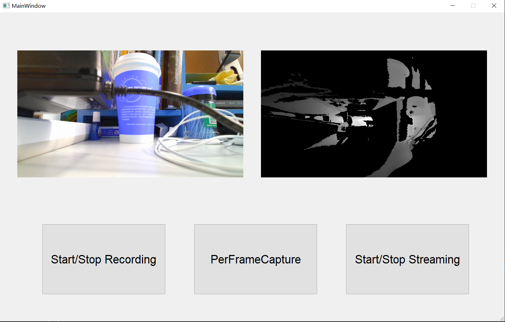

# Logger4AzureKinect
A QT application to record data streams from Azure Kinect (on Windows 10)

# Dependencies
1.	Azure SDK (official Azure Kinect SDK, refer to https://github.com/microsoft/Azure-Kinect-Sensor-SDK/blob/develop/docs/usage.md), download the latest Azure Kinect SDK 1.4.1.exe and install
2.	QT (current used version 5.12.8, which can be found at: https://download.qt.io/official_releases/qt/5.12/5.12.8/)
3.	Boost (current used version 1.77.0 at https://boostorg.jfrog.io/ui/native/main/release/1.77.0/source/), download zip file and install.
4.	OpenCv (current used version 3.4.16, at https://opencv.org/releases/)
5.	Zlib (version 1.2.11, https://www.zlib.net/)

# Build
Open KinectAzureRecorder.sln in Visual Studio 2017, and then build with x86 Release option, that's all

# GUI
